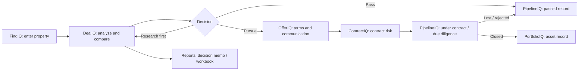
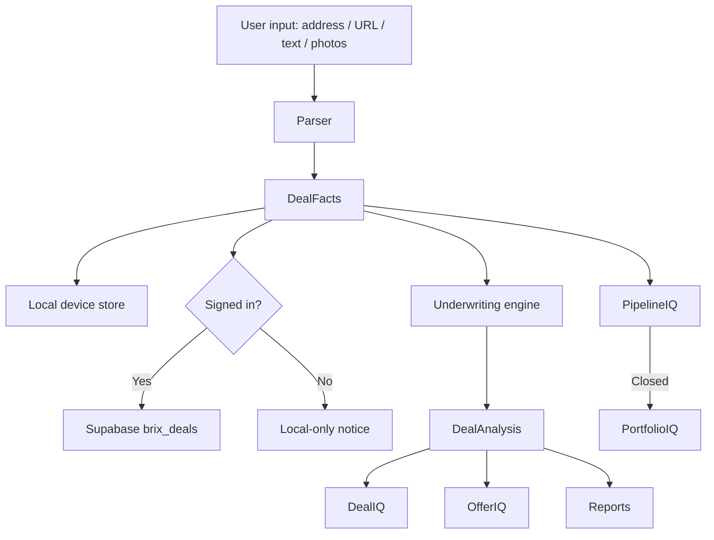

# BRIX Application Whiteboard

Status: working product architecture map

Purpose: force BRIX to be designed, built, and debugged as one cohesive investment operating system instead of a collection of patched screens.

## Product Identity

BRIX is a real estate acquisition and ownership decision system.

The user should feel this sequence:

1. Start with a property.
2. Choose the decision lens.
3. BRIX builds the deal file.
4. BRIX identifies what is known, missing, risky, and worth checking.
5. BRIX compares strategies.
6. BRIX helps the user decide whether to visit, research first, pursue, pass, contract, close, or track as an asset.

The app must not feel like:

- A marketing page behind login.
- A spreadsheet with nicer cards.
- A mock workflow.
- A set of disconnected modules.
- A form that asks the user to do all the work.

## Primary Object Model

### User

Owns:

- Account
- Plan
- Deal files
- Portfolio assets
- Reports

### Deal File

The center of acquisition work.

Created from:

- Address
- Listing URL
- Listing text
- Manual property facts
- Mobile field entry

Contains:

- Source input
- Parsed property facts
- Strategy selection
- Photos
- Notes
- Verification state
- Underwriting assumptions
- Strategy comparison
- Offer plans
- Pipeline status
- Reports

### Strategy

Controls:

- Required inputs
- Assumptions
- Risk checks
- Success criteria
- Failure scenarios
- Metrics
- Next actions

Strategies must include the full catalog from the corpus, not only rental examples.

### Asset

Created only after a deal closes.

Contains:

- Acquisition history
- Final purchase data
- Ownership performance
- Equity
- Cash flow
- documents
- long-term portfolio review

## Core App Flow



## Entry Architecture

BRIX must open into the product, not an account wall.

### Signed Out

Allowed:

- Open app shell.
- Start a property.
- Choose strategy.
- Generate local device analysis.
- Review strategy fit.

Limited:

- No cross-device sync.
- No cloud persistence guarantee.
- No account-level history.

Required UX:

- Account tab explains sign in briefly.
- Workflow must not redirect the user to Account unexpectedly.
- If a cloud action requires auth, explain that inside the workflow and keep the user's work.

### Signed In

Allowed:

- Cloud save
- Cross-device sync
- Supabase-backed deal files
- Account deletion
- Admin-controlled plan rules
- Future paid provider access

## Web Screen Map

### FindIQ

Purpose: start the deal file.

Screen must show:

- One primary input: address, listing URL, or listing text.
- One primary strategy selector.
- One primary action: create deal file.

Screen must not show:

- Search feeds unless live provider search is connected.
- Fake property cards.
- Internal provider commentary.
- Multiple competing add-property buttons.

Output:

- Deal file created.
- Parsed facts populated where possible.
- Unknown fields remain empty.
- User lands in DealIQ.

### DealIQ

Purpose: decide whether the property deserves more time, verification, or pursuit.

Screen must show in order:

1. Decision signal.
2. Confidence and readiness.
3. Missing facts.
4. Property facts.
5. Strategy comparison.
6. Photos and condition evidence.
7. Area and tax verification links.
8. Next actions.
9. Report/export actions.

Screen must support:

- Edit facts.
- Upload photos.
- Delete deal quickly.
- Switch selected strategy.
- Compare all strategy candidates.
- Advance into OfferIQ or PipelineIQ.

### OfferIQ

Purpose: turn a good or conditional DealIQ output into pursuit strategy.

Screen must show:

- Conservative, balanced, and competitive offer structures.
- Price, earnest money, inspection period, closing period.
- Risks and conditions.
- Walk-away guidance when confidence is weak.

Must not imply legal advice.

### ContractIQ

Purpose: review contract text for visible risk signals.

Screen must show:

- Contract input area.
- Clause findings.
- Severity.
- Recommended verification.

Must not replace attorney review.

### PipelineIQ

Purpose: track opportunity status.

Screen must show:

- Active deals by status.
- Next status movement.
- Passed/lost records.
- Under contract / due diligence state.

Must not duplicate DealIQ analysis.

### PortfolioIQ

Purpose: monitor owned assets after closing.

Screen must show:

- Closed assets only.
- Portfolio totals.
- Equity estimate.
- Annual net.
- Asset open action.

Must not show unclosed deals as assets.

### Reports

Purpose: export decision output.

Screen must show:

- Recommendation.
- Confidence.
- Readiness.
- financial read.
- Missing facts.
- Evidence.
- Strategy comparison.
- Bull case.
- Bear case.
- Failure scenarios.
- PDF and workbook export.

### Account

Purpose: account, privacy, plan, and sync.

Screen must show:

- Email.
- Password.
- Sign in.
- Create account.
- Reset password.
- Sign out.
- Request account deletion.
- Privacy/support links.

Must not be the first screen unless the user navigates there.

## Native iOS Screen Map

Native iOS is not a scaled webpage.

It should feel like a field and decision instrument:

- Fast entry.
- Native tab bar.
- Large touch targets.
- Clear hierarchy.
- Strong visuals without clutter.
- Photos as a first-class workflow.

### iOS Find

Must open first.

Must support:

- Address/listing/text intake.
- Strategy picker.
- Create local deal if signed out.
- Cloud save if signed in.
- Move to Deal tab after create.

### iOS Deal

Must support:

- Decision signal.
- Confidence/readiness.
- Editable facts.
- Strategy comparison.
- Photo upload.
- Next actions.
- Delete deal.

### iOS Account

Must be a tab, not the app gate.

Must support:

- Sign in.
- Create account.
- Reset password.
- Sign out.
- Account deletion request.
- Privacy/terms/support links.

## Data Flow



## Calculation Contracts

### Required Core Inputs

- Address
- Purchase price
- Annual taxes
- Annual insurance

### Rental Inputs

- Monthly rent support
- Vacancy
- Maintenance
- Management
- Insurance
- Taxes
- HOA
- Financing

### Renovation Inputs

- Rehab budget
- Scope confidence
- ARV
- Timeline
- Carrying cost

### Owner Occupant Inputs

- Down payment
- Monthly payment
- Annual taxes
- Insurance
- HOA
- Commute / location fit
- resale risk
- condition tolerance

## Decision Output Contract

Every major decision output must include:

- Recommendation
- Confidence
- Readiness
- Evidence
- Missing information
- Key risks
- Strategy comparison
- Bull case
- Bear case
- What must be true
- Failure scenarios
- Next actions

## Verification Gates

The app must never silently pass these failures:

- Web app does not boot.
- iOS opens into Account instead of product.
- Create deal button does nothing.
- Create deal loses user input.
- Signed-out local work redirects away unexpectedly.
- Signed-in cloud save fails silently.
- Route button leads to blank screen.
- Export button fails without message.
- Strategy list is incomplete.
- Strategy scoring ignores selected strategy.
- Report shows stale selected deal.
- iOS source file missing from target membership.
- App Store archive lacks bundle executable.
- Privacy manifest missing.
- Launch storyboard missing for iPad.

## Debug Routine Required Before Commit

### Web

- Typecheck passes.
- Test suite passes.
- Production build passes.
- Static scan finds no template/demo/prototype markers.
- Signed-out `/app` opens FindIQ.
- Signed-out create deal opens DealIQ.
- Signed-in create deal calls Supabase.
- Cloud failure keeps user in workflow with visible error.
- Every nav item renders a screen.
- Report export buttons are wired.

### iOS Static

Windows cannot run Xcode archive.

Local static checks must still confirm:

- `BRIXRealEstateiOSApp.swift` exists and is target source.
- `AppView` always opens the tab shell.
- `FindIQView` is available signed out.
- `Info.plist` includes `CFBundleExecutable`.
- Product type is iOS application.
- `MACH_O_TYPE = mh_execute`.
- `SKIP_INSTALL = NO`.
- Launch storyboard is in resources.
- Privacy manifest is in resources.
- App icons are present.
- No `ContentView` / `Hello World`.

### Mac Required

On Mac before App Store upload:

```bash
cd ios/BRIXRealEstateiOS
bash scripts/verify-ios-project.sh
```

After Xcode archive:

```bash
bash scripts/inspect-archive.sh /path/to/BRIXRealEstateiOS.xcarchive
```

## Build Rule Going Forward

No module is done until:

1. Its screen purpose is clear.
2. Its primary user action works.
3. Its empty state explains what to do next.
4. Its data input has a destination.
5. Its output follows the decision standard.
6. Its failure mode is visible.
7. Its navigation path is tested.
8. Its iOS equivalent exists or is intentionally documented.

